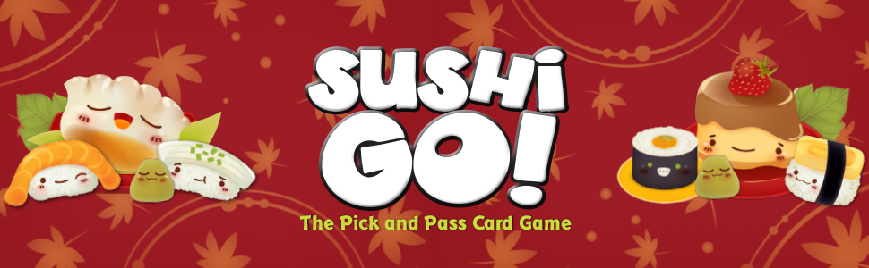
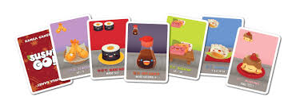

# Sushi Go: Biostatistics Final Project

## Introduction
"Sushi Go!" is a card game of strategy and sushi creation. Our project aims to bring this fun and competitive game to life through simulation. 

The game revolves around players who strategically play their cards to accumulate points, however, on each turn the player switches their hand to the player next to them. The goal of this project is to simulate an enitre game of three players which consists of 3 rounds with 9 cards per player per round. At every round, on each turn all players must play a card and leave it on the table at the same time, and then switch their hand to the player next to them. this will be repeated until all cards are played. At the end of each round the score will be tallied, and at the end of all three rounds special points will be added or substracted depending on the *Cumulative Overall Card*.  This simulation will not only provide an enjoyable virtual experience but also serve as a valuable learning tool for those looking to master the art of Sushi Go! strategy, offering insights and tactics that can be applied in real-life gameplay.

## Type of Cards

### Stand-alone Cards
- Squid Nigiri: 3 points
- Salmon Nigiri: 2 points
- Egg Nigiri: 1 point

### Multiplier card
In combination with one Stand-Alone cards, multiplies their value by three
- Wasabi card

### Cumulative-No Penalty Cards
Repeated cards multiply the score.
- Dumpling cards:
- 1 card: 1 points
- 2 cards: 3 points
- 3 cards: 6 points
- 4 cards: 10 points
- 5 cards: 15 points

### Cumulative-Penalty Cards
A determined number of cards needs to be played to get all points, else 0 points.
- Sashimi: 3 cards, 10 points
- Tempura: 2 cards, 5 points
- 
### Cumulative-Interactive Cards:
At the end of each round the player that accumulates the most points by summing all their maki cards gets 6 points, second best gets 3 points. 
- Maki Rolls: 1, 2, 3

### Cumulative Overall Card
At the end of the three rounds, the player with the most puddinng cards wins extra points, and the player with less pudding cards loses points.
- Pudding: +6 or -6 points

### Complex Strategy
Each player could strategize based on not only their current hand but also information or probabilities based on previous hands.

Each player needs a defined strategy of either:
1. Maximizing points of the current play based on the table cards and their current hand before playing a card.
2. Maximizing points based on the probability of getting the cumulative cards in subsequent rounds to maximize cards of this card.

### Danger Zone Strategy (very complex type of card)
- Chopstick card: When played, the player can play two cards together in the next round after playing this card.

## Skeletal Structure of the Game in Python
We plan to have multiple classes - `Card`, `Deck`, `Player`, and `Game` - that account for different features of the game and then calculate the winner based on the highest number of points. In this simulation, the game is structured around multiple rounds where players try to maximize their points by collecting and playing sets of cards efficiently, with the end goal of having the highest score at the conclusion of all rounds.

Here is a brief overview of the function of each class in our library:

### Class: Card
Represents a single sushi-themed playing card. Each card has a type indicating its category, such as "Tempura" or "Sashimi".

### Class: Deck
Manages a collection of cards used in the game. This class is responsible for creating a full deck of cards, shuffling them, and distributing them among players to start the game.

### Class: Player
Describes a participant in the game. This includes managing the player's hand of cards, recording which cards have been played, calculating scores based on the rules of the game, and tracking specific scoring combinations.

### Class: Game
Coordinates the overall gameplay. It initializes the deck and players, handles the flow of the game across multiple rounds, determines the scores after each round, and at the end, identifies the winner of the game. Each round involves players drawing and playing a card from their hand according to strategic goals.

### Class:Score
Adds the points at the end of each round according to cumulative cards, non cumulative cards and cumulative-interaction cards
Adds points at the end of the three rounds

### Class: Sushi platter
Generates image of the winning player sushi plater according to all the cards he played
